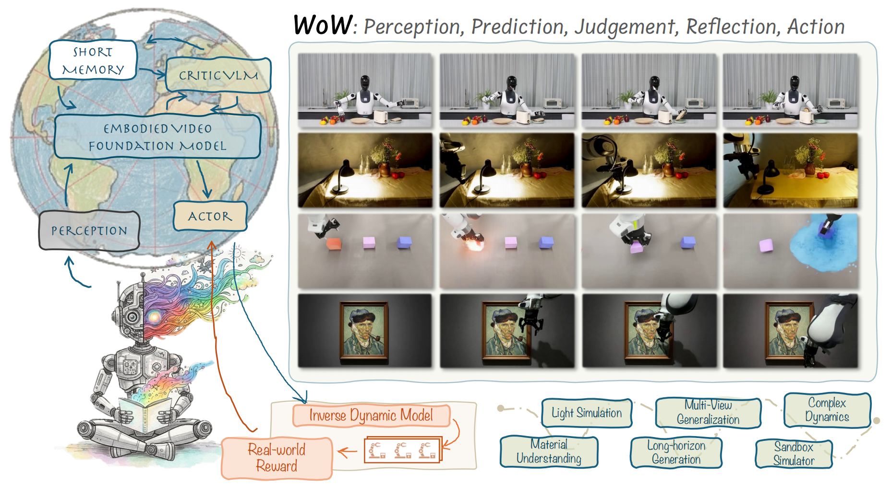

# 🌍 WoW: World-Omniscient World Model

> Towards an Embodied, Physically-Consistent Generative World Model

[](https://arxiv.org/abs/2509.22642)
[](LICENSE)
[](https://wow-world-model.github.io)


---

WoW (World-Omniscient World Model) is a 14B-parameter generative world model trained on **2 million robotic interaction trajectories**, designed to **imagine**, **reason**, and **act** in the physical world. Unlike passive video models, WoW learns from **real-world, causally rich data**, enabling robust physical reasoning and real-world planning.

<!-- ---

## 🔬 Key Features

- **📽️ Diffusion-Based Video Generation**  
  High-fidelity, physically grounded future prediction from images + instructions.
- **🧠 SOPHIA Framework**  
  Self-optimizing, closed-loop system integrating a VLM critic and DiT generator for iterative refinement.
- **🤖 Imagination-to-Action Loop**  
  FM-IDM translates predicted videos into 7-DoF robot actions executed in the physical world.
- **📊 WoWBench Benchmark**  
  Comprehensive evaluation suite across 4 dimensions and 20+ physical tasks.
- **🧪 Advanced Reasoning**  
  Supports counterfactual planning, logical parsing, tool use, and compositional reasoning.
- **🧩 Applications**  
  Novel-view synthesis, trajectory-guided generation, action-to-video generation, visual style transfer, VLM task planning via simulation

--- -->

## 📖 Paper & Demo

<div align="center">
  
</div>

**WoW world model** generates high-quality, physically consistent robot action videos in Out-of-Distribution (OOD) scenarios, enabling closed-loop corrections and real-world robotic execution. The illustration shows the model's strong generalization across diverse tasks and environments.

**Authors:**

Xiaowei Chi<sup>1,2,3</sup>†, Peidong Jia<sup>1,2</sup>†, Chun-Kai Fan<sup>1,2</sup>†, Xiaozhu Ju<sup>1</sup>†, Weishi Mi<sup>1</sup>†, Zhiyuan Qin<sup>1</sup>†, Kevin Zhang<sup>2</sup>, Wanxin Tian<sup>1</sup>, Kuangzhi Ge<sup>2</sup>, Hao Li<sup>1</sup>, Zezhong Qian<sup>1,2</sup>, Anthony Chen<sup>2</sup>, Qiang Zhou<sup>1,2</sup>, Yueru Jia<sup>2</sup>, Jiaming Liu<sup>2</sup>, Yong Dai<sup>1</sup>, Qingpo Wuwu<sup>2</sup>, Chengyu Bai<sup>2</sup>, Yu-Kai Wang<sup>2</sup>, Ying Li<sup>2</sup>, Lizhang Chen<sup>1,2</sup>, Yong Bao<sup>1</sup>, Zhiyuan Jiang<sup>1</sup>, Jiacheng Zhu<sup>1</sup>, Kai Tang<sup>2</sup>, Ruichuan An<sup>2</sup>, Yulin Luo<sup>2</sup>, Qiuxuan Feng<sup>1,2</sup>, Siyuan Zhou<sup>3</sup>, Chi-min Chan<sup>3</sup>, Chengkai Hou<sup>1,2</sup>, Wei Xue<sup>3</sup>, Sirui Han<sup>3</sup>, Yike Guo<sup>3</sup>, [Shanghang Zhang]()<sup>2</sup>✉, [Jian Tang]()<sup>1</sup>✉

<sup>1</sup> Beijing Innovation Center of Humanoid Robotics  
<sup>2</sup> State Key Laboratory of Multimedia Information Processing, School of Computer Science, Peking University  
<sup>3</sup> Hong Kong University of Science and Technology


## 📰 News！
- 🔥 **[Oct 2025]** We've officially released **WoW**, a 14B-parameter generative world model trained on 2M real-world robot trajectories, and model groups!
- 🚀 **All model weights and benchmark datasets are now open-sourced** on [Hugging Face](https://huggingface.co/WoW-world-model)!
  
## 🧠 Open-Sourced Weights & Dataset

We have open-sourced the following models and datasets on [Hugging Face](https://huggingface.co/WoW-world-model):

| Model Name | Parameters | Training Steps | Link | 
|------------|------------|----------------|------|
| WoW-1-DiT-2B-600k | 2B | 600k | [🔗 Link](https://huggingface.co/WoW-world-model/WoW-1-DiT-2B-600k) |
| WoW-1-DiT-7B-600k | 7B | 600k | [🔗 Link](https://huggingface.co/WoW-world-model/WoW-1-DiT-7B-600k) |
| WoW-1-Wan-14B-600k | 14B | 600k | [🔗 Link](https://huggingface.co/WoW-world-model/WoW-1-Wan-14B-600k) |
| WoW-1-Wan-14B-2M | 14B | 2M | [🔗 Link](https://huggingface.co/WoW-world-model/WoW-1-Wan-14B-2M) |
| Wan-1-Wan-1.3B-2M | 14B | 2M | [🔗 Comming Soon](https://huggingface.co/WoW-world-model/Wan-1-Wan-14B-600k) |

### 📊 Benchmark Dataset

| Dataset Name | Description | Link |
|--------------|-------------|------|
| WoW-1-Benchmark-Samples | Evaluation set used in WoWBench for physical consistency and causal reasoning. | [📄 Link](https://huggingface.co/datasets/WoW-world-model/WoW-1-Benchmark-Samples) |


## 🚀 Open Source Roadmap

> **WoW (World-Omniscient World Model)** is a physically grounded generative world model designed to advance general-purpose robot intelligence. To promote transparency, collaboration, and progress in the community, we are releasing our components in phases:

<div style="background: #f8f8f8; border-radius: 12px; padding: 18px; margin-bottom: 18px; border-left: 6px solid #EC707D;">

### ✅ Phase 1 – *Published*
- [x] Paper released on [arXiv:2509.22642](https://arxiv.org/abs/2509.22642)
- [x] Project website launched: [wow-world-model.github.io](https://wow-world-model.github.io)

### 🚧 Phase 2 – *Planned for Oct. 2025*
- [x] **Model Weights (2B, 7B, 14B WoW-DiT)**
- [ ] **Baseline Model Weights (SVD, CogVideoX, Cosmos1&2)**
- [x] **Inference Scripts & Colab Demo**
- [ ] **Flow-Mask Inverse Dynamics Model (FM-IDM)**

### 🚀 Phase 3 – *Planned for Dec. 2025*
- [ ] **Training Pipeline**
- [ ] **SOPHIA Framework Code**
- [ ] **WoWBench benchmark design & evaluation metrics released**

### 🌐 Phase 4 – *2026 Onward*
- [ ] Continuous release of real/simulated trajectory data
- [ ] Expansion to multimodal inputs (e.g., audio, tactile)
- [ ] Universal fine-tuning API for downstream tasks
- [ ] Community challenges and leaderboard integration

</div>

---

## 🧰 Installation

Coming soon. We plan to release:

- [x] Pretrained WoW models (2B, 7B, 14B)
- [ ] WoWBench dataset & evaluation scripts
- [ ] SOPHIA framework codebase
- [ ] FM-IDM module for robot control

---

## 🚀 Quick Demo

Visit our interactive demo at:  
👉 [**wow-world-model.github.io**](https://wow-world-model.github.io)

---

## 🤝 How You Can Get Involved

- 📥 Submit issues or suggest features  
- 🔧 Improve code or documentation with pull requests  
- 📊 Run experiments and submit results to WoWBench  
- 🤖 Contribute real-world robot data

---

## 📬 Contact
- If you prefer some specific kinds of world models on embodied manipulation scenes, or if the issue is solved too slowly, feel free to contact litwellchi@gmail.com

- Project website: [wow-world-model.github.io](https://wow-world-model.github.io)  

---

> “We don’t just generate videos — we generate grounded imagination, reasoning, and embodied action.”

---

## 📖 Citation

If you use WoW in your research, please cite:

```bibtex
@article{chi2025wow,
  title={WoW: Towards a World omniscient World model Through Embodied Interaction},
  author={Chi, Xiaowei and Jia, Peidong and Fan, Chun-Kai and Ju, Xiaozhu and Mi, Weishi and Qin, Zhiyuan and Zhang, Kevin  and Tian, Wanxin and Ge, Kuangzhi and Li, Hao and others},
  journal={arXiv preprint arXiv:2509.22642},
  year={2025}
}
```
